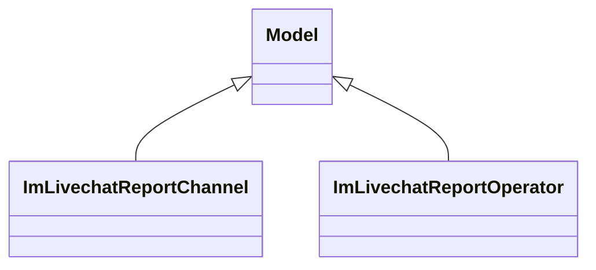

# Reports

Report definitions and templates in im_livechat.

## Available Reports

### Analytical/Dashboard Reports
- **Operator Analysis** (Analysis/Dashboard)
- **Session Statistics** (Analysis/Dashboard)

## Report Files

- **im_livechat_report_channel.py** (Python logic)
- **im_livechat_report_channel_views.xml** (XML template/definition)
- **im_livechat_report_operator.py** (Python logic)
- **im_livechat_report_operator_views.xml** (XML template/definition)
- **__init__.py** (Python logic)

## Notes
- Named reports above are accessible through Odoo's reporting menu
- Python files define report logic and data processing
- XML files contain report templates, definitions, and formatting
- Reports are integrated with Odoo's printing and email systems
