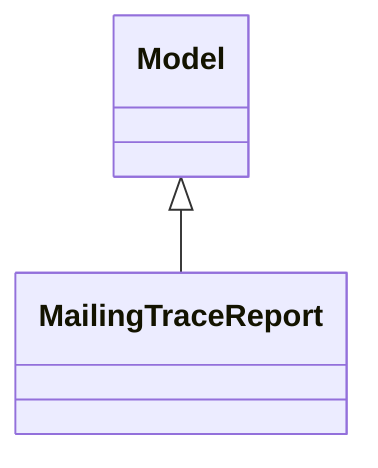

# Reports

Report definitions and templates in mass_mailing.

## Available Reports

No named reports found in XML files.

## Report Files

- **__init__.py** (Python logic)
- **mailing_trace_report.py** (Python logic)
- **mailing_trace_report_views.xml** (XML template/definition)

## Notes
- Named reports above are accessible through Odoo's reporting menu
- Python files define report logic and data processing
- XML files contain report templates, definitions, and formatting
- Reports are integrated with Odoo's printing and email systems
